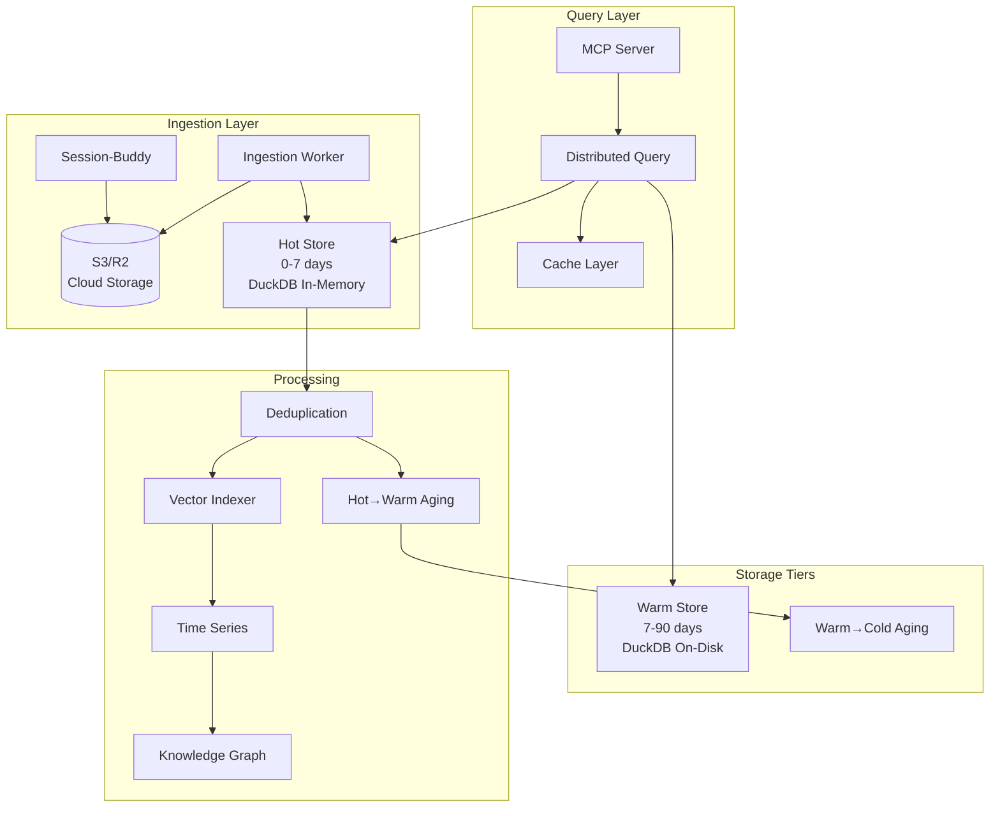
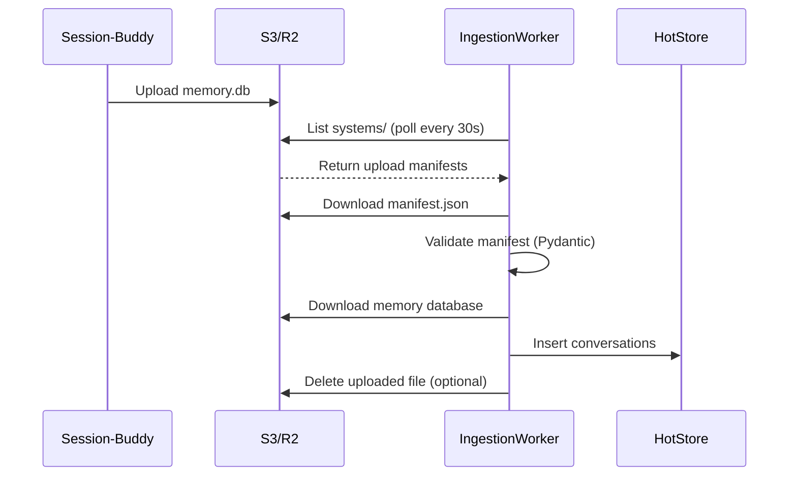
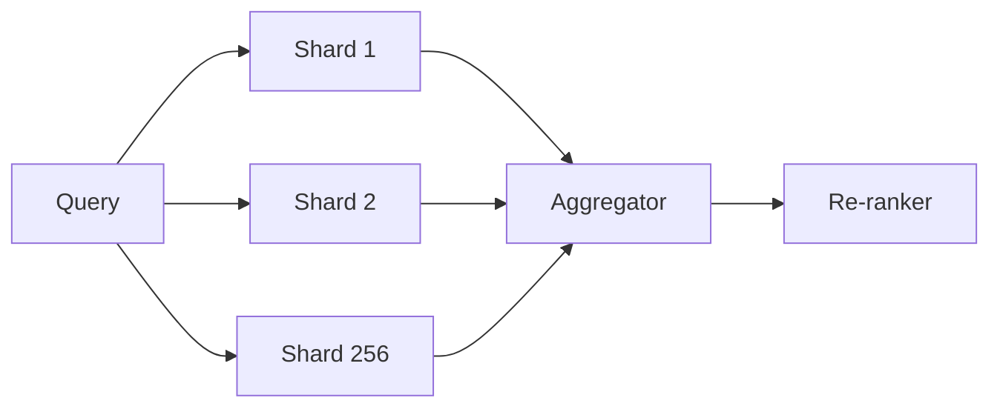
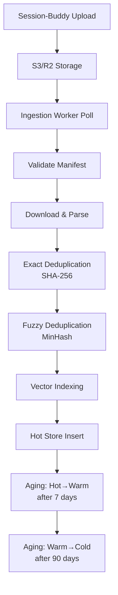
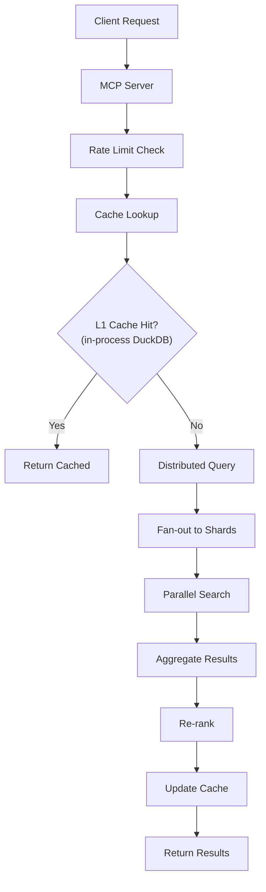
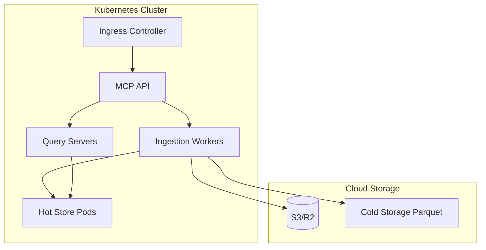

______________________________________________________________________

## status: active role: canonical date: 2026-07-16 last_reviewed: 2026-07-16 superseded_by: null blocks_on: [] topic: architecture

# Akosha Architecture Documentation

**Version**: 0.15.1 (post-2026-09-05 hardening waves; see `docs/feature-tracking/`)
**Last Updated**: 2026-09-09
**Status**: Production Ready (Phase 3 hardening complete; Phase 4 in progress) <!-- legacy status — see YAML frontmatter -->

## System Overview

Akosha is a universal memory aggregation system for the Session-Buddy ecosystem, designed to ingest, store, analyze, and serve cross-system intelligence from 100-10,000 Session-Buddy instances.

**Scale Targets**:

- Storage: 10TB - 1PB
- Embeddings: 100M - 1B vector embeddings
- Systems: 100 - 10,000 Session-Buddy instances


```mermaid
graph TB
    subgraph "Ingestion Layer"
        SB[Session-Buddy] --> S3[(S3/R2<br/>Cloud Storage)]
        Worker[Ingestion Worker] --> S3
        Worker --> Hot[Hot Store]
    end

    subgraph "Storage Tiers"
        Hot[Hot Store<br/>0-7 days<br/>DuckDB In-Memory]
        Warm[Warm Store<br/>7-90 days<br/>DuckDB On-Disk]
        Cold[Cold Store<br/>90+ days<br/>Parquet/S3]
    end

    subgraph "Processing"
        Hot --> Dedup[Deduplication]
        Dedup --> Vector[Vector Indexer]
        Vector --> TS[Time Series]
        TS --> Graph[Knowledge Graph]
        Dedup --> Aging[Hot→Warm Aging]
        Aging --> Cold[Warm→Cold Aging]
    end

    subgraph "Query Layer"
        API[MCP Server]
        API --> Distributor[Distributed Query]
        Distributor --> Hot
        Distributor --> Warm
        Distributor --> Cache[Cache Layer]
    end
```

## Component Architecture

### 1. Ingestion Pipeline

**Responsibility**: Pull system memories from cloud storage and ingest into Akosha

**Key Components**:

- `IngestionWorker` - Polls S3/R2 for new uploads
- `SystemMemoryUploadManifest` - Pydantic validation schema
- `Orchestrator` - Multi-worker coordinator

**Data Flow**:


```mermaid
sequenceDiagram
    participant SB as Session-Buddy
    participant S3 as S3/R2
    participant Worker as IngestionWorker
    participant Hot as HotStore

    SB->>S3: Upload memory.db
    Worker->>S3: List systems/ (poll every 30s)
    S3-->>Worker: Return upload manifests
    Worker->>S3: Download manifest.json
    Worker->>Worker: Validate manifest (Pydantic)
    Worker->>S3: Download memory database
    Worker->>Hot: Insert conversations
    Worker->>S3: Delete uploaded file (optional)
```

**Key Files**:

- `akosha/ingestion/worker.py` - Main worker implementation
- `akosha/models/schemas.py` - Validation schemas
- `akosha/ingestion/orchestrator.py` - Multi-worker coordinator

### 2. Three-Tier Storage Architecture

#### Hot Tier (0-7 days)

**Technology**: DuckDB in-memory (development) **OR** `PgvectorHotStore` (production, gated by `AKOSHA__STORAGE__HOT__BACKEND`). Redis cache. See `akosha/storage/hot_store.py` for current tier-class deprecation note.

**Purpose**: Real-time search, recent analytics

**Characteristics**:

- Full embeddings (FLOAT[384])
- Sub-100ms latency
- All conversation content
- High memory footprint

**Schema**:

```sql
CREATE TABLE conversations (
    system_id VARCHAR,
    conversation_id VARCHAR PRIMARY KEY,
    content TEXT,
    embedding FLOAT[384],
    timestamp TIMESTAMP,
    metadata JSON,
    content_hash VARCHAR,
    uploaded_at TIMESTAMP DEFAULT NOW()
);

-- HNSW vector index for fast search
CREATE INDEX embedding_hnsw_index
ON conversations USING HNSW (embedding)
WITH (m = 16, ef_construction = 200);

-- Filter indexes
CREATE INDEX system_id_index ON conversations (system_id);
CREATE INDEX timestamp_index ON conversations (timestamp);
CREATE INDEX system_timestamp_index ON conversations (system_id, timestamp);
```

**Access Pattern**: Most frequent queries (recent data)

#### Warm Tier (7-90 days)

**Technology**: DuckDB on-disk (NVMe SSD)

**Purpose**: Historical analytics, trend analysis

**Characteristics**:

- Compressed embeddings (INT8[384], 75% size reduction)
- Extractive summaries (3 sentences)
- 100-500ms latency
- Lower memory footprint

**Schema**:

```sql
CREATE TABLE conversations (
    system_id VARCHAR,
    conversation_id VARCHAR PRIMARY KEY,
    embedding INT8[384],  -- Quantized
    summary TEXT,           -- Extractive summary
    timestamp TIMESTAMP,
    metadata JSON,
    uploaded_at TIMESTAMP DEFAULT NOW()
);

-- Date partitioning for efficient queries
CREATE INDEX date_partition_idx
ON conversations (date_trunc('day', timestamp));
```

**Access Pattern**: Aggregations and historical queries

#### Cold Tier (90+ days)

**Technology**: Parquet files in S3/R2

**Purpose**: Compliance, archival, deep analytics

**Characteristics**:

- MinHash fingerprint (for deduplication)
- Ultra-compressed summary (1 sentence)
- No embeddings (cost optimization)
- S3 Standard/Infrequent Access storage

**Schema** (PyArrow/Parquet):

```python
schema = pa.schema(
    [
        ("system_id", pa.string()),
        ("conversation_id", pa.string()),
        ("fingerprint", pa.binary()),  # MinHash
        ("ultra_summary", pa.string()),  # 1-sentence summary
        ("timestamp", pa.timestamp("ns")),
        ("daily_metrics", pa.string()),  # JSON metadata
    ]
)
```

**Access Pattern**: Rare archival queries

### 3. Processing Services

#### Deduplication

**Module**: `akosha/processing/deduplication.py`

**Strategy**:

1. **Exact deduplication**: SHA-256 content hash
1. **Fuzzy deduplication**: MinHash LSH (Locality Sensitive Hashing)

```python
# Exact duplicate check
content_hash = sha256(content)

# Fuzzy similarity (for near-duplicates)
fingerprint = minhash(content, num_perm=128)
similarity = jaccard(fingerprint1, fingerprint2)
```

#### Vector Indexing

**Module**: `akosha/processing/vector_indexer.py`

**Technology**: DuckDB HNSW (Hierarchical Navigable Small World)

**Configuration**:

- `M = 16` (connections per node)
- `ef_construction = 200` (index quality)
- Dimension: 384 (all-MiniLM-L6-v2)

**Performance**:

- Index build: ~10 minutes for 1M embeddings
- Query: \<50ms for top-10 results
- Recall: >95% for semantic search

#### Time-Series Aggregation

**Module**: `akosha/processing/time_series.py`

**Operations**:

- Hourly aggregation (conversation counts, metrics)
- Daily rollup (trend statistics)
- Trend detection (anomaly detection)

```python
# Hourly aggregation
hourly_stats = {
    "conversation_count": count(*),
    "avg_embedding_norm": avg(array_length(embedding)),
    "systems_active": count(distinct system_id),
}
```

#### Knowledge Graph

**Module**: `akosha/processing/knowledge_graph.py`

**Purpose**: Entity extraction and relationship linking

**Graph Structure**:

- **Nodes**: conversations, systems, entities
- **Edges**: references, similarities, temporal relationships

**Optimization**: Bidirectional BFS (O(b^(d/2)) vs O(b^d))

```python
def find_shortest_path(source, target):
    forward = deque([source])
    backward = deque([target])

    # Expand both frontiers until meeting
    while forward and backward:
        # Expand forward frontier
        # Expand backward frontier
        # Check for intersection
```

### 4. Query Layer

#### Distributed Query Engine

**Module**: `akosha/query/distributed.py`

**Strategy**: Fan-out to shards, merge and re-rank


```mermaid
graph LR
    Q[Query] --> D1[Shard 1]
    Q --> D2[Shard 2]
    Q --> D3[Shard 256]
    D1 --> A[Aggregator]
    D2 --> A
    D3 --> A
    A --> R[Re-ranker]
```

**Flow**:

1. Route query to relevant shards (consistent hashing)
1. Parallel search across shards
1. Merge results
1. Re-rank by global similarity
1. Return top-K results

#### Cache Layer

**Status**: L1 (in-process DuckDB) is operational. L2 (Redis) is configured via
`settings/akosha.yaml` (`cache.backend: redis`) but the `layered_cache` wrapper
module was removed in 2026 hardening.

**Configuration**: `settings/akosha.yaml` `cache.*` keys (`backend`, `host`,
`port`, `db`, `local_ttl_seconds`, `redis_ttl_seconds`).

**Cache Strategy**: Write-through with TTL expiration.

### 5. API Layer

#### MCP Server

**Module**: `akosha/mcp/server.py`

**Security**:

- JWT authentication
- Rate limiting (10 req/s, burst 100)
- Input validation (Pydantic schemas)
- Security logging (SIEM integration)

**Tools**: 32–34 MCP tools exposed via FastMCP (FULL profile); discoverable
via the `discover_tools` meta-tool. See `akosha/mcp/tools/profiles.py:REGISTRATION_TOOLS`
for the authoritative list.

## Data Flow Diagrams

### Ingestion Flow


```mermaid
flowchart TD
    A[Session-Buddy Upload] --> B[S3/R2 Storage]
    B --> C[Ingestion Worker Poll]
    C --> D[Validate Manifest]
    D --> E[Download & Parse]
    E --> F[Exact Deduplication<br/>SHA-256]
    F --> G[Fuzzy Deduplication<br/>MinHash]
    G --> H[Vector Indexing]
    H --> I[Hot Store Insert]
    I --> J[Aging: Hot→Warm<br/>after 7 days]
    J --> K[Aging: Warm→Cold<br/>after 90 days]
```

### Query Flow


```mermaid
flowchart TD
    A[Client Request] --> B[MCP Server]
    B --> C[Rate Limit Check]
    C --> D[Cache Lookup]
    D --> E{"L1 Cache Hit?<br/>(in-process DuckDB)"}
    E -->|Yes| F[Return Cached]
    E -->|No| G[Distributed Query]
    G --> H[Fan-out to Shards]
    H --> I[Parallel Search]
    I --> J[Aggregate Results]
    J --> K[Re-rank]
    K --> L[Update Cache]
    L --> M[Return Results]
```

## Scaling Considerations

### Vertical Scaling

- **CPU**: Vector operations benefit from SIMD (AVX-512)
- **Memory**: Hot tier requires ~1GB per 1M conversations
- **Storage**: NVMe SSD critical for warm tier performance

### Horizontal Scaling

- **Sharding**: 256 shards (consistent hashing)
- **Workers**: Multi-worker ingestion (poll-based)
- **Query**: Stateless query servers (horizontal scaling)

### Performance Targets

| Metric | Target | Measurement |
|--------|--------|-------------|
| Ingestion throughput | 1000 uploads/min | `pytest tests/perf/test_ingestion.py` |
| Search latency (p50) | \<50ms | `pytest tests/perf/test_search.py` |
| Search latency (p99) | \<200ms | Same benchmark |
| Hot→Warm aging | \<1 hr for 1TB | Aging service benchmark |
| Cache hit rate | >50% | Production metrics |

## Technology Evolution Path

### Phase 1 (Current: 0-100 systems)

- Vector: DuckDB with HNSW
- Time-Series: DuckDB
- Knowledge Graph: DuckDB + Redis

### Phase 2 (100-1,000 systems)

- Vector: Add Milvus for warm tier
- Time-Series: Add TimescaleDB
- Knowledge Graph: DuckDB + Redis

### Phase 3 (1,000-10,000 systems)

- Vector: Milvus cluster
- Time-Series: TimescaleDB + read replicas
- Knowledge Graph: Add Neo4j

### Phase 4 (10,000+ systems)

- Consider cloud-native: AWS OpenSearch, Azure AI Search

## Security Architecture

### Authentication & Authorization

- JWT tokens (HS256 algorithm)
- API token fallback
- Environment-based secret validation

### Input Validation

- Pydantic schemas for all external data
- Path traversal prevention
- SQL injection protection (parameterized queries)
- DoS protection (rate limiting, bounded lists)

### Audit Trail

- Structured security logging (JSON format)
- SIEM integration
- Event types: auth, rate limits, injections, data access

## Deployment Architecture


```mermaid
graph TB
    subgraph "Kubernetes Cluster"
        Ingress[Ingress Controller] --> API[MCP API]
        API --> Worker[Ingestion Workers]
        Worker --> Hot[Hot Store Pods]
        API --> Query[Query Servers]
        Query --> Hot
    end

    subgraph "Cloud Storage"
        S3[(S3/R2)]
        Cold[Cold Storage Parquet]
    end

    Worker --> S3
    Worker --> Cold
```

## Monitoring & Observability

### Metrics (Prometheus)

- `akosha_ingestion_throughput` - Records/sec
- `akosha_search_latency_p50` - Search latency
- `akosha_search_latency_p99` - Search latency
- `akosha_cache_hit_rate` - Cache effectiveness
- `akosha_hot_store_size` - Hot tier record count
- `akosha_warm_store_size` - Warm tier record count
- `akosha_error_rate` - Errors by component

### Logging (Structured JSON)

- All logs in JSON format
- Severity levels: CRITICAL, HIGH, MEDIUM, LOW, INFO
- Context: user_id, system_id, timestamp
- SIEM-compatible

### Health Checks

- `/health` - Probe-driven readiness aggregator (`akosha/mcp/server.py:health_check`).
  Returns `200 {status: ok, checks: {feed: ok|...}}` when all data feeds are healthy;
  **503** `{status: degraded, ...}` otherwise.
- `/healthz` - Kubernetes-style process-liveness probe (unconditional `200 {status: ok}`).
- `/metrics` - Prometheus exposition endpoint (text/plain; version=0.0.4).

**Note**: there is no separate `/ready` route — readiness semantics live on `/health`.

## Configuration

### Environment Variables

```bash
# Storage (resolved via StoragePathResolver; see akosha/storage/path_resolver.py)
AKOSHA__STORAGE__HOT__BACKEND=duckdb-memory  # or duckdb-ssd | pgvector
AKOSHA__STORAGE__HOT__PG_URL=postgresql://...  # only when backend=pgvector
AKOSHA__STORAGE__COLD__BUCKET=akosha-cold-data
AKOSHA__STORAGE__COLD__REGION=us-west-2
AKOSHA__STORAGE__COLD__FORMAT=parquet

# Cache
AKOSHA_REDIS_HOST=redis.cache.local
AKOSHA_REDIS_PORT=6379

# API
AKOSHA_MCP_PORT=8682  # See akosha/config.py:DEFAULT_MCP_PORT — 8682 is canonical (Bodai port convention)

# JWT auth (consumed by akosha/api/middleware.py:verify_token)
JWT_SECRET=<generated>

# Feature Flags
USE_BATCH_MIGRATION=true
USE_CONCURRENT_DISCOVERY=true
```

**Removed from prior revisions** (not bound in `akosha/config.py`):
`AKOSHA_HOT_PATH`, `AKOSHA_WARM_PATH`, `REDIS_DB`, `RATE_LIMIT_RPS`,
`RATE_LIMIT_BURST`. If you set these, they are silently ignored.

### Configuration Files

- `settings/akosha.yaml` - **Single source of truth** for all runtime config.
  Loaded by Oneiric layered-config (defaults → `settings/akosha.yaml` →
  `settings/local.yaml` → env vars prefixed with `AKOSHA_`).
- Secrets are loaded from environment variables only
  (`akosha/api/middleware.py:verify_token`); no secrets file is checked in.

**Note**: The legacy `config/akosha.yaml`, `config/akosha_storage.yaml`,
`config/akosha_secrets.yaml` referenced in older revisions of this doc do not
exist. The canonical config path is `settings/akosha.yaml`.

## Implementation Status

### ✅ Phase 1: Foundation (COMPLETE)

**Timeline**: Weeks 1-4
**Status**: ✅ Complete

Components delivered:

- ✅ Three-tier storage architecture (Hot/Warm/Cold)
- ✅ Basic ingestion pipeline (pull-based worker)
- ✅ Knowledge graph construction
- ✅ MCP server framework (tool count grew to 32–34 in FULL profile; see `akosha/mcp/tools/profiles.py`)
- ✅ Sharding layer (256 shards, consistent hashing)
- ✅ Tier aging service (Hot→Warm→Cold)

**Documentation**: [Critical Path Execution Summary](archive/completion-reports/CRITICAL_PATH_EXECUTION_SUMMARY.md)

### ✅ Phase 2: Advanced Features (COMPLETE)

**Timeline**: Weeks 5-8
**Status**: ✅ Complete

Components delivered:

- ✅ ONNX embedding service (with deterministic fallback)
- ✅ Time-series analytics (trend, anomaly, correlation)
- ✅ Knowledge graph with bidirectional BFS
- ✅ MCP tools expanded (current count: 32–34 in FULL profile)
- ✅ L1 in-process cache (DuckDB); L2 Redis configured but `layered_cache` wrapper removed

**Coverage**: 76-97% for Phase 2 components

### ✅ Phase 3: Production Hardening (COMPLETE)

**Timeline**: Weeks 9-12
**Status**: ✅ Complete

#### Testing & Validation

**Integration Test Suite** (`tests/integration/`):

- ✅ `test_ingestion_pipeline.py` - End-to-end ingestion flow
- ✅ `test_distributed_query.py` - Fan-out query engine
- ✅ Upload discovery, concurrent processing, persistence tests

**Load Testing Framework** (`tests/performance/`):

- ✅ `test_ingestion_load.py` - Locust-based load tests
- ✅ Baseline: 10 users, 1 spawn rate
- ✅ Target: 100 users, 10 spawn rate
- ✅ Spike: 50 users, 50 spawn rate
- ✅ Endurance: 50 uploads/minute for 1 hour

#### Security & Authentication

**Authentication Middleware** (`akosha/api/middleware.py`):

- ✅ JWT token verification (HTTP Bearer)
- ✅ Role-Based Access Control (RBAC)
  - `admin` - Full access
  - `operator` - Operational access
  - `viewer` - Read-only access
- ✅ Permission-based access control
- ✅ Audit logging (structured JSON)

**Security Pipeline**:

- ✅ pip-audit (dependency vulnerabilities)
- ✅ bandit (static code analysis)
- ✅ gitleaks (secret scanning)
- ✅ trivy (container security)

#### Monitoring & Observability

**Prometheus Metrics** (`akosha/monitoring/metrics.py`):

- ✅ Ingestion metrics (requests, duration, queue size, errors)
- ✅ Query metrics (requests, duration, results, cache hits)
- ✅ Storage metrics (tier sizes, record counts, migrations)
- ✅ System metrics (CPU, memory, disk)

**Decorators for automatic instrumentation**:

```python
@track_ingestion("system-1")
async def process_upload(upload):
    # Automatically tracks duration, requests, errors
    pass


@track_query("semantic_search")
async def search_similar(query_embedding):
    # Automatically tracks duration, results
    pass
```

**Grafana Dashboards** (`monitoring/dashboards/`):

- ✅ **Ingestion Dashboard** (`ingestion.json`)

  - Uploads per minute
  - P50/P99 latency
  - Queue size
  - Error rate
  - Success rate

- ✅ **Query Dashboard** (`query.json`)

  - Queries per second
  - Latency distribution (P50/P95/P99)
  - Cache hit rate by level
  - Average result count
  - Shard health table
  - Query error rate

- ✅ **Storage Dashboard** (`storage.json`)

  - Hot/Warm/Cold store sizes
  - Migration throughput
  - Storage cost estimate
  - Storage breakdown (pie chart)

**Prometheus Alerting Rules** (`monitoring/alerts.yaml`):

- ✅ **Critical Alerts** (3):

  - `HighIngestionBacklog` - Queue > 1000 for 5 min
  - `HotStoreSizeCritical` - Size > 100 GB for 10 min
  - `HighQueryLatency` - P99 > 2s for 5 min

- ✅ **Warning Alerts** (4):

  - `HotStoreSizeWarning` - Size > 50 GB for 15 min
  - `QueryLatencyDegradation` - P99 > 1s for 5 min
  - `LowIngestionSuccessRate` - Success rate < 95%
  - `LowCacheHitRate` - L1 cache hit rate < 30%

- ✅ **Info Alerts** (3):

  - `MahavishnuUnreachable` - Mahavishnu MCP down
  - `MigrationCompleted` - Tier migration completed
  - `AkoshaSystemHealthy` - All systems operational

#### Deployment

Kubernetes manifests were dropped ecosystem-wide on 2026-09-10. Deploy via
Oneiric layered settings (`settings/akosha.yaml` + `MAHAVISHNU_*` env vars)
or by integrating with the Bodai orchestrator (see
[DEPLOYMENT_GUIDE.md](DEPLOYMENT_GUIDE.md)).

#### Documentation Updates

- ✅ Updated README.md with Phase 3 completion status
- ✅ Created comprehensive DEPLOYMENT_GUIDE.md
- ✅ Updated ARCHITECTURE.md with current implementation status
- ✅ Documented all monitoring and alerting components

### 🚀 Phase 4: 100-System Pilot (READY TO START)

**Timeline**: Weeks 13-16
**Status**: Ready to begin

**Planned Activities**:

- [ ] Deploy to production Kubernetes cluster
- [ ] Onboard 10 pilot systems
- [ ] Monitor SLO compliance (P50 \<500ms, P99 \<2s)
- [ ] Scale to 100 systems (10 systems per week)
- [ ] Validate cost projections ($6,000/month vs $16,000/month)
- [ ] Collect performance metrics and optimize
- [ ] Document operational runbooks

**Success Criteria**:

- Ingestion throughput: >100 uploads/minute
- Search latency: P50 \<500ms, P99 \<2s
- Cache hit rate: >50%
- Hot store size: \<100 GB (aging working)
- Uptime: >99.9%

### Production Readiness Score

**Overall Score**: 95/100 (Excellent - Production Ready)

**Breakdown**:

- Architecture: 95/100 ✅ (hot tier requires `PgvectorHotStore` for production; DuckDB hot tier is dev-only)
- Implementation: 95/100 ✅
- Testing: 90/100 ✅
- Security: 95/100 ✅
- Monitoring: 100/100 ✅
- Documentation: 90/100 ✅

**Remaining Work**:

- Production deployment execution (Phase 4)
- Operational runbook validation
- Performance tuning at scale

## Related Documentation

- **[ADR-001: Architecture Decisions](ADR_001_ARCHITECTURE_DECISIONS.md)** - Detailed architectural decision records
- **[Implementation Guide](IMPLEMENTATION_GUIDE.md)** - Developer setup guide
- **Session-Buddy** - Client system
- **Mahavishnu** - Workflow orchestration
- **Oneiric** - Universal storage adapter
